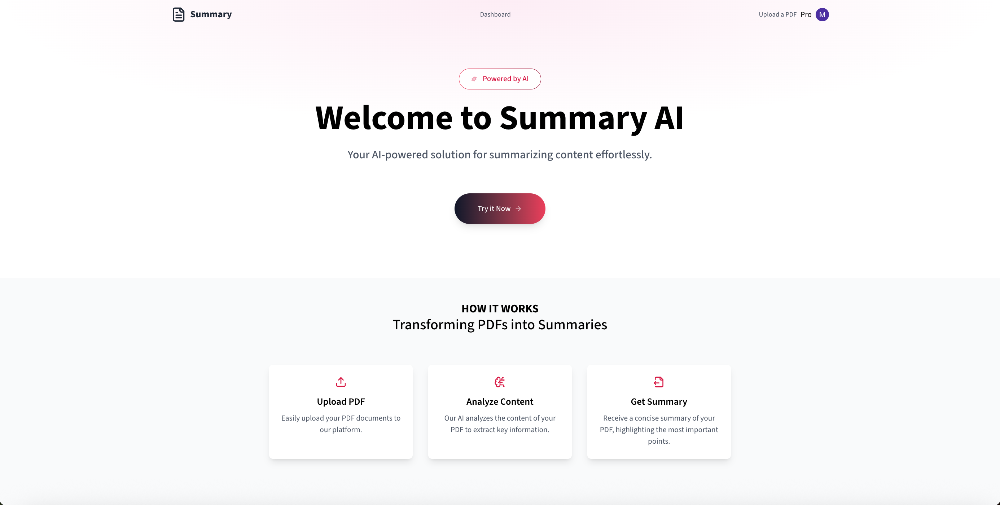
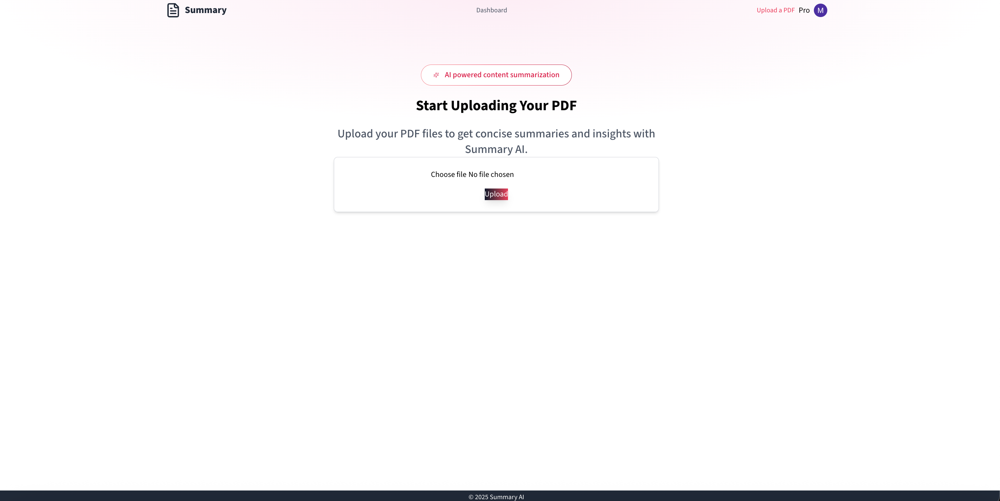

# Summary AI

Summary AI is a Next.js application that automatically generates concise summaries from large text pdf.

## Installation

```bash
git clone https://github.com/mayankn792/summary-ai.git
cd summary-ai
npm install
```

## Usage

Start the development server:

```bash
npm run dev
```

Open [http://localhost:3000](http://localhost:3000) in your browser. Sign in and Upload a document to generate a summary.

## Screenshots

#### homepage



#### upload page



#### dashboard


